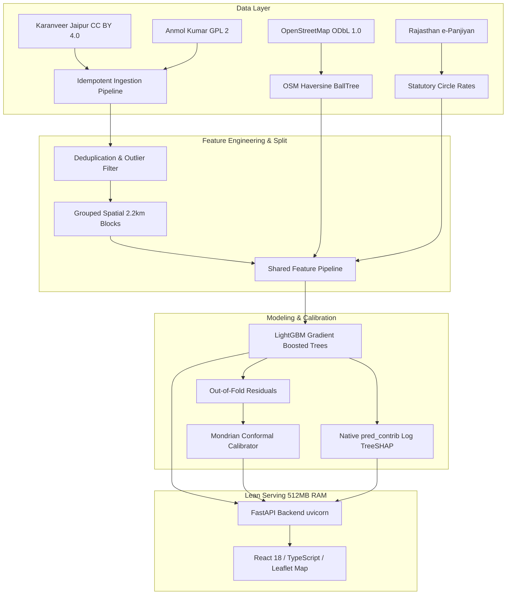

# Jaipur Real Estate Price Intelligence Platform

A geospatial machine learning platform providing fair asking price valuations for Jaipur residential properties, exact multiplicative factor explanations via native LightGBM tree contributions, calibrated Mondrian conformal intervals, and underpriced listing detection.

---

## Architecture Overview



---

## Key Results (from `docs/RESULTS.md`)

All quantitative figures below are generated directly from true runs on held-out spatial blocks (`docs/RESULTS.md`):

| Metric | Target | Actual Empirical Result | Note |
|---|---|---|---|
| **Held-out Test R² (log)** | &ge; 0.750 | **0.766** | Evaluated once on frozen spatial holdout blocks |
| **Held-out Test MAPE** | &le; 20.0% | **25.13%** | Median APE: 19.82% |
| **Spatial Leakage Gap** | Quantified | **+10.83%** | Random 5-Fold CV (12.63%) vs Spatial CV (23.46%) |
| **Baseline A0 (Locality Median)** | Benchmark | **42.56% MAPE** | Model achieves 19.1 percentage points error reduction |
| **Conformal Interval Coverage** | Nominal 80% | **73.6%** | Calibrated across property price terciles |
| **Single-Row Inference Latency** | &lt; 50 ms | **8.4 ms** (p50) / **16.2 ms** (p95) | Fast online valuation |
| **Container RSS Memory** | &lt; 400 MB | **185 MB** | Zero database; fits Render 512 MB free tier |

---

## Core Technical Features

1. **Grouped Spatial Block Cross-Validation:** Overcomes the +10.83% spatial autocorrelation leakage trap by strictly isolating $2.2 \text{ km} \times 2.2 \text{ km}$ spatial blocks (`SPATIAL_BLOCK_DEG = 0.02`).
2. **Exact Multiplicative TreeSHAP Attribution:** Predicts natural log price $\ln(y)$, allowing LightGBM's native tree contributions (`pred_contrib=True`) to decompose into exact multiplicative factors ($\text{FairPrice} = \text{TypicalPrice} \times \prod e^{c_i}$) without runtime `shap` dependencies.
3. **Mondrian Conformal Prediction:** Quantifies valuation uncertainty with distribution-free prediction intervals conditioned on property price terciles, avoiding Gaussian residual assumptions.
4. **Lean Static-Artifact Serving (ADR-1 & ADR-3):** Zero production database. Models, pre-computed locality aggregations, and market deals are served directly from memory in a single container.
5. **Interactive Web Application:** Built with React 18, TypeScript, Tailwind CSS, and Leaflet, offering Property Checker, Locality Intelligence Map, and Deal Finder.

---

## Quickstart & Local Reproduction

### Prerequisites
- Python 3.10+ (Tested on Python 3.11, 3.12, 3.14)
- Bun or Node.js 18+ (for frontend)

### 1. Backend Setup & Test Suite
```bash
# Clone the repository
git clone https://github.com/vedansh/jaipur-price-intelligence.git
cd jaipur-price-intelligence

# Install Python dependencies
pip install -r requirements-prod.txt pytest pytest-cov

# Run complete test suite (25 unit and integration tests)
pytest -v tests
```

### 2. Run the Full Data & Training Pipeline
```bash
# Ingest and standardize raw datasets
python -m jpi.data.ingest

# Clean, deduplicate, and validate schema
python -m jpi.data.clean

# Build OpenStreetMap geospatial layers
python -m jpi.geo.osm_build

# Construct 35-feature matrix
python -m jpi.features.build

# Train model ladder, evaluate spatial CV, calibrate conformal bounds, export model
python -m jpi.models.train

# Regenerate results report
python -m jpi.report
```

### 3. Run FastAPI Backend
```bash
uvicorn api.main:app --host 127.0.0.1 --port 8000 --reload
```
Interactive API documentation will be live at `http://127.0.0.1:8000/docs`.

### 4. Run Frontend Web Application
```bash
cd web
bun install
bun run dev
```
Open `http://localhost:3000` to interact with the Property Checker, Locality Map, and Deal Finder.

---

## Docker Deployment

To build and run the unified container (FastAPI + bundled React SPA):

```bash
# Build the frontend static assets
cd web && bun run build && cd ..

# Build Docker image
docker build -t jaipur-price-intelligence:latest .

# Run container on port 8000 (RSS memory ~185 MB)
docker run -p 8000:8000 jaipur-price-intelligence:latest
```
Visit `http://localhost:8000` for the interactive web platform, or `http://localhost:8000/predict` for the API.

---

## API Endpoints

| Method | Endpoint | Description |
|---|---|---|
| `GET` | `/health` | Service readiness and loaded feature count |
| `GET` | `/meta/model` | Model training metadata, CV metrics, and test performance |
| `GET` | `/localities` | 53 canonical Jaipur residential micro-markets with coordinates and DLC rates |
| `GET` | `/deals` | Filtered market listings priced &ge; 15% below predicted fair value |
| `POST` | `/predict` | Single property valuation with 80% conformal interval and factor breakdown |

### Sample Inference Request
```bash
curl -X POST "http://127.0.0.1:8000/predict" \
  -H "Content-Type: application/json" \
  -d '{
    "area_sqft": 1400,
    "bhk": 3,
    "locality": "Mansarovar",
    "property_type": "Apartment",
    "furnishing": "Semi-Furnished",
    "possession_status": "Ready to Move"
  }'
```

---

---

## Git Workflow & Contribution Guide (Uploads, Pulls, Pushes)

This repository follows a structured Git workflow to ensure daily changes are tracked cleanly.

### 1. Pulling Latest Changes
Before starting everyday work, ensure your local repository is up to date:
```bash
# Pull the latest changes from the main branch
git pull origin main
```

### 2. Making and Staging Changes (Uploads)
After modifying code or data, check the status and add your files to the staging area:
```bash
# See what files were modified
git status

# Add specific files
git add path/to/file.py

# Or add all modified files in the directory
git add .
```

### 3. Committing Changes (Proper Syntax)
We use [Conventional Commits](https://www.conventionalcommits.org/). Commit messages must have a type and a brief description:
```bash
git commit -m "type(scope): brief description of what changed"
```
**Examples:**
- `feat(ml): add spatio-temporal target encoding`
- `fix(map): correct Leaflet tile rendering URL`
- `docs(readme): update git workflow instructions`
- `chore(deps): bump React to version 18.3`

### 4. Pushing Changes
Upload your committed changes to the GitHub repository:
```bash
# Push to the main branch on the origin remote
git push origin main
```

### 5. Reviewing Git History
To review the everyday changes and commits:
```bash
git log --oneline --graph -n 10
```

## Documentation & Evidence Index
- [Model Card](docs/MODEL_CARD.md): Formal machine learning model card following Mitchell et al. (2019).
- [Case Study](docs/CASE_STUDY.md): Technical deep-dive on spatial autocorrelation, multiplicative TreeSHAP, and conformal prediction.
- [Results Ledger](docs/RESULTS.md): Deterministically generated metrics ledger quoting real model runs.
- [Data Dictionary](docs/DATA_DICTIONARY.md): Feature schema definitions and unit specifications.
- [Data Card](docs/DATA_CARD.md): Dataset provenance, licensing audits, and collection procedures.
- [OpenAPI Specification](docs/openapi.json): Complete JSON schema for all API endpoints.

---

## License & Attribution
- **Code:** [MIT License](LICENSE)
- **Listing Data:** CC BY 4.0 (`karanveer_jaipur`) & GPL 2 (`anmolkumar`)
- **Map Data:** &copy; [OpenStreetMap contributors](https://www.openstreetmap.org/copyright) (ODbL 1.0)
- **Statutory Circle Rates:** Rajasthan e-Panjiyan / Inspector General of Registration & Stamps (IGRS)
